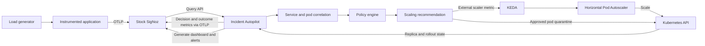
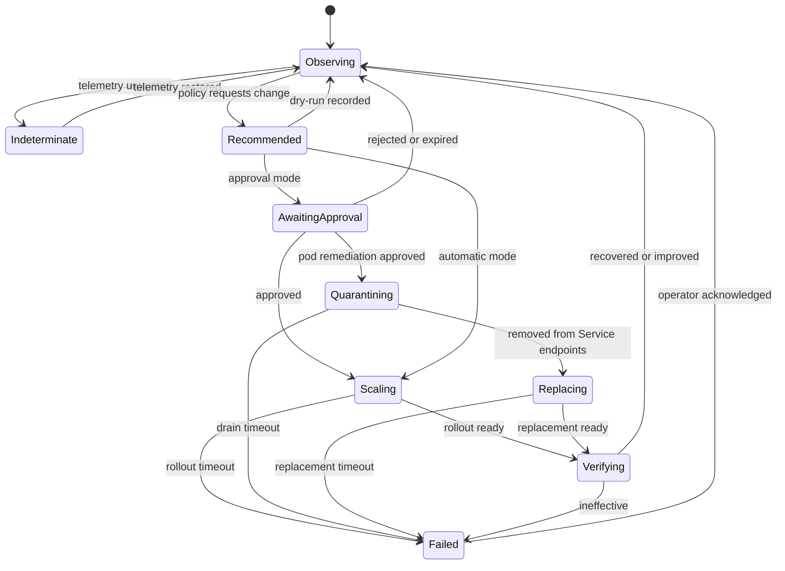

# SigNoz Incident Autopilot

## Summary

SigNoz Incident Autopilot is a companion service for a stock, self-hosted
SigNoz installation. It continuously reads service telemetry from SigNoz,
explains when a workload needs additional capacity, recommends a safe replica
count, optionally exposes that recommendation to KEDA, and verifies whether the
scaling action restored service health.

The hackathon implementation supports one remediation: scaling a Kubernetes
Deployment. It does not modify SigNoz source code.

## Product statement

SigNoz explains what is happening in a system. Incident Autopilot closes the
loop by turning trustworthy telemetry into safe, explainable, and verifiable
scaling actions.

## Goals

- Use stock SigNoz as the source of operational truth.
- Detect load-driven service degradation using multiple signals.
- Distinguish service-wide capacity pressure from a localized unhealthy pod.
- Explain every recommendation with concrete telemetry evidence.
- Support dry-run, approval, and automatic execution modes.
- Integrate with Kubernetes through KEDA.
- Quarantine and safely replace an unhealthy pod after operator approval.
- Refuse to act when telemetry is stale, incomplete, or contradictory.
- Emit recommendation and outcome telemetry back into SigNoz.
- Generate a native SigNoz dashboard and human-facing alerts.
- Provide a deterministic, reproducible hackathon demonstration.

## Non-goals

- General-purpose incident remediation.
- Arbitrary shell or infrastructure command execution.
- Automated deployment rollback.
- ML-based root-cause analysis.
- Replacing Kubernetes HPA or KEDA.
- Modifying the SigNoz frontend or backend.
- Supporting multiple remediation types in the MVP.

## User experience

### Setup

The operator supplies:

- SigNoz URL and service-account API key.
- Kubernetes namespace and Deployment name.
- Minimum and maximum replicas.
- Target request rate per replica.
- Latency and error-rate guardrails.
- Polling, cooldown, and verification windows.
- Operating mode: `dry-run`, `approval`, or `automatic`.

The setup command validates connectivity, discovers the required telemetry
fields, generates the SigNoz dashboard and alerts, and starts the controller.

### Runtime

For every evaluation interval, the operator can see:

- Current request rate, P95 latency, error rate, and replicas.
- Telemetry freshness and confidence.
- Recommended replica count.
- Evidence used in the decision.
- Current controller state.
- Last action and verification result.

Example recommendation:

> Scale `checkout-api` from 2 to 6 replicas. Request rate increased 310%,
> P95 latency is 1.2 seconds against an 800 ms target, and the error rate is
> rising. Telemetry is complete and 14 seconds old.

Example localized diagnosis:

> Pod `checkout-api-7d9c` accounts for 68% of checkout errors while receiving
> 17% of requests. Its readiness endpoint has failed three consecutive checks.
> Quarantine it, add one replacement replica, and remove it after the
> replacement becomes ready.

## Architecture



### Why the controller is outside SigNoz

- Stock SigNoz remains easy to install and upgrade.
- The controller can use public query and dashboard APIs.
- Kubernetes credentials remain isolated from SigNoz.
- Scaling logic can be tested independently.
- Judges can reproduce the integration without compiling a SigNoz fork.

## Components

### 1. SigNoz query client

Queries a configured time window for:

- Request rate.
- P95 request latency.
- Error rate.
- The configured service-level indicator and objective.
- Optional saturation signal.
- The same signals grouped by Kubernetes pod identity.
- Relevant error traces and structured logs for the affected service or pod.
- Timestamp of the newest matching sample.

All queries must filter by the configured service and environment. The client
returns typed results with explicit `value`, `observed_at`, and `present`
fields. Missing data is not represented as zero.

### 2. Kubernetes reader

Reads:

- Current desired and available replicas.
- Deployment generation and rollout state.
- Pod readiness.
- Pod restart count, phase, conditions, and probe failures.
- The last scaling action initiated by Autopilot.

The MVP grants read access to the Deployment. Automatic mode additionally
requires the permissions needed by KEDA/HPA; Autopilot itself does not require
general-purpose cluster administration.

### 3. Service and pod correlation

The correlation layer joins SigNoz telemetry with Kubernetes state using stable
resource attributes:

- `service.name`
- `k8s.namespace.name`
- `k8s.deployment.name`
- `k8s.pod.name`
- `k8s.pod.uid`

It compares each pod with the service baseline. A pod becomes a localized
suspect only when it has sufficient traffic and repeatedly exceeds configured
error or latency deviation thresholds. A single trace or probe failure is never
enough to trigger remediation.

The diagnosis classifies the incident as:

- `capacity_pressure`: degradation is distributed across healthy pods.
- `localized_pod_failure`: one or a small subset of pods are clear outliers.
- `functional_failure`: errors are widespread but unrelated to saturation.
- `indeterminate`: evidence is missing, stale, or contradictory.

This classification determines whether scaling can help. Functional failures
and indeterminate incidents are escalated without automatic scaling.

### 4. Telemetry trust gate

The trust gate runs before the policy engine. It blocks scaling when:

- Any required signal is missing.
- The newest sample exceeds the freshness limit.
- The service selector returns multiple unintended workloads.
- Kubernetes reports an incomplete rollout.
- SigNoz or Kubernetes cannot be reached.

Blocked evaluations emit an `indeterminate` decision with a reason. They never
silently become a scale-down recommendation.

### 5. Policy engine

The first implementation is deterministic.

Base demand:

```text
demand_replicas = ceil(request_rate / target_requests_per_replica)
```

Pressure multipliers:

- Increase demand when P95 latency exceeds its target.
- Increase demand when the error rate exceeds its target and traffic is high.
- Permit scale-up when the configured SLI is below its objective and the
  evidence classifies the cause as capacity pressure.
- Do not treat errors as load pressure when traffic is low; that likely
  indicates a functional failure that scaling cannot fix.

Final recommendation:

```text
recommended = clamp(
  demand_replicas * pressure_multiplier,
  min_replicas,
  max_replicas
)
```

The policy returns:

- Recommended replicas.
- Recommended remediation: `scale`, `quarantine_replace`, `hold`, or
  `investigate`.
- Decision: `scale_up`, `scale_down`, `hold`, or `indeterminate`.
- Evidence list.
- Confidence.
- Policy version.

### 6. Safety controller

The safety controller applies:

- Separate scale-up and scale-down thresholds.
- Faster scale-up than scale-down.
- A cooldown following every scaling action.
- Maximum replica change per evaluation.
- Absolute minimum and maximum replicas.
- No scale-down during elevated latency or errors.
- No new action while a prior rollout is incomplete.
- A manual kill switch.

Dry-run is the default mode. Approval mode records a recommendation and waits
for operator confirmation. Automatic mode exposes the computed desired value to
KEDA.

Pod remediation remains approval-only in the MVP, even when scaling is
automatic.

### 7. Kubernetes-native pod quarantine and replacement

Target workloads opt into a custom readiness gate managed by Autopilot. For an
approved localized pod remediation, Autopilot:

1. Sets the custom readiness condition to false.
2. Waits for Kubernetes EndpointSlice propagation so the Service stops routing
   new traffic to that pod.
3. Increases the Deployment's desired capacity by one through the same bounded
   scaling policy.
4. Waits for a replacement pod to pass startup and readiness probes.
5. Deletes the quarantined pod.
6. Returns the Deployment to the policy-recommended replica count after the
   verification and cooldown windows.

Application health checks run through Kubernetes startup, readiness, and
liveness probes against a pod-local health endpoint. Autopilot reads probe
results and may request that endpoint through a controlled diagnostic client;
it does not execute arbitrary commands inside containers.

If the replacement does not become ready, Autopilot keeps the original pod
quarantined, stops further remediation, and raises a rollout-failed alert.

### 8. KEDA integration

Autopilot implements the KEDA External Scaler gRPC contract:

- `IsActive`: returns active when scaling pressure is present.
- `GetMetricSpec`: describes the external desired-replica metric.
- `GetMetrics`: returns the current policy recommendation.
- `StreamIsActive`: optional after the polling implementation is stable.

KEDA converts the external metric into an HPA target. Kubernetes remains
responsible for applying the replica change.

For a lower-risk first milestone, Autopilot may publish a Prometheus-compatible
recommendation metric and use KEDA's Prometheus scaler. The gRPC external
scaler is the preferred final demo because it makes the integration explicit.

### 9. Verification engine

After a scale action:

1. Wait for Deployment readiness or a verification timeout.
2. Query the same SigNoz signals over the post-action window.
3. Compare them with the pre-action baseline.
4. Classify the outcome:
   - `recovered`
   - `improved`
   - `ineffective`
   - `rollout_failed`
   - `indeterminate`
5. Emit the outcome and evidence to SigNoz.

If the configured SLI remains below its objective after scaling, Autopilot does
not keep adding replicas indefinitely. It stops at the bounded recommendation,
checks for localized pod outliers, and either proposes an approved
quarantine-and-replace action or raises an investigation alert.

The MVP does not automatically undo an ineffective scale-up. It stops further
actions, raises a human-facing alert, and recommends investigation.

### 10. Notifications and approvals

Recommendations are sent through a configured SigNoz notification channel.
The notification contains:

- Affected service and pods.
- SLI objective and observed value.
- Proposed action and replica change.
- Evidence summary.
- Expiry time.
- A link to the Autopilot approval endpoint and the relevant SigNoz view.

Approval tokens are short-lived, scoped to one immutable action, and recorded
in the audit log. Replaying an approval cannot execute the action twice.

### 11. SigNoz writer

Autopilot emits these metrics through OTLP:

| Metric | Important attributes |
| --- | --- |
| `autopilot_recommended_replicas` | service, namespace, deployment, decision |
| `autopilot_current_replicas` | service, namespace, deployment |
| `autopilot_decision_total` | decision, reason, mode, policy_version |
| `autopilot_telemetry_freshness_seconds` | service, signal |
| `autopilot_action_total` | action, result |
| `autopilot_pod_health` | service, namespace, pod, state |
| `autopilot_quarantine_total` | service, reason, result |
| `autopilot_verification_latency_ratio` | service, action_id |
| `autopilot_verification_error_ratio` | service, action_id |

Decision explanations should be emitted as structured logs correlated by
`action_id`. Metrics must avoid unbounded attributes such as raw error messages.

## Controller state machine



State transitions and decisions are persisted so a controller restart does not
repeat an action.

## SigNoz dashboard

The generated dashboard contains:

1. Current replicas versus recommended replicas.
2. Request rate, P95 latency, and error rate.
3. Controller decision and confidence.
4. Telemetry freshness by signal.
5. Scaling actions over time.
6. Pre-action versus post-action health.
7. Decisions blocked by safety guards.
8. Estimated replica-minutes added or avoided.
9. Per-pod error and latency outliers.
10. Quarantine and replacement history.

Each action row links to the relevant SigNoz time range and service filters.

## Alerts

Human-facing SigNoz alerts cover:

- Autopilot is indeterminate because telemetry is stale.
- A recommendation remains unapproved beyond its expiry.
- Kubernetes rollout failed.
- A pod quarantine or replacement failed.
- Scaling did not improve service health.
- Maximum replicas were reached while the SLO remained unhealthy.
- The controller has not emitted a heartbeat.

SigNoz alerts notify people; they are not used as the real-time scaling input.
The controller queries SigNoz directly to avoid notification latency.

## Configuration

```yaml
signoz:
  url: http://signoz:8080
  api_key_env: SIGNOZ_API_KEY

target:
  service: checkout-api
  environment: demo
  namespace: demo
  deployment: checkout-api
  readiness_gate: autopilot.signoz.io/healthy

signals:
  request_rate_query: "sum(rate(http_server_request_duration_seconds_count{service_name=\"checkout-api\"}[2m]))"
  p95_latency_query: "histogram_quantile(0.95, sum by (le) (rate(http_server_request_duration_seconds_bucket{service_name=\"checkout-api\"}[2m])))"
  error_rate_query: "sum(rate(http_server_request_duration_seconds_count{service_name=\"checkout-api\",http_response_status_code=~\"5..\"}[2m])) / sum(rate(http_server_request_duration_seconds_count{service_name=\"checkout-api\"}[2m]))"
  sli_query: "1 - (sum(rate(http_server_request_duration_seconds_count{service_name=\"checkout-api\",http_response_status_code=~\"5..\"}[5m])) / sum(rate(http_server_request_duration_seconds_count{service_name=\"checkout-api\"}[5m])))"
  sli_objective: 0.99
  freshness_limit: 60s

policy:
  min_replicas: 2
  max_replicas: 10
  target_requests_per_replica: 25
  latency_target_ms: 800
  error_rate_target: 0.02
  max_scale_up_step: 4
  max_scale_down_step: 1
  cooldown: 2m
  pod_outlier:
    minimum_requests: 20
    error_rate_multiplier: 3
    latency_multiplier: 2
    consecutive_evaluations: 3

controller:
  mode: dry-run
  evaluation_interval: 15s
  verification_window: 2m
  state_path: /var/lib/autopilot/state.json
```

## Failure handling

- SigNoz unavailable: emit an error locally, hold replicas, and become
  `indeterminate`.
- Kubernetes unavailable: do not recommend executable changes.
- Partial query response: reject the evaluation.
- Invalid configuration: fail startup before serving KEDA.
- KEDA requests during an indeterminate state: return a neutral/hold value.
- Restart during rollout: recover state from the persisted action record and
  continue verification.
- Readiness-gate patch fails: preserve the pod, abort remediation, and notify.
- EndpointSlice does not remove a quarantined pod before timeout: do not delete
  the pod; abort and notify.
- Unknown policy version in persisted state: require operator acknowledgement.

## Security

- Use a least-privilege SigNoz service account.
- Keep API keys in environment variables or Kubernetes Secrets.
- Use TLS for non-local SigNoz and OTLP endpoints.
- Scope Kubernetes permissions to one namespace and Deployment.
- Permit only readiness-condition updates and deletion for pods owned by the
  configured Deployment.
- Never execute arbitrary commands from telemetry or model output.
- Validate every generated SigNoz URL and Kubernetes identifier.
- Record an audit event for approvals and actions.

## Testing strategy

### Unit tests

- Policy calculations and clamping.
- Hysteresis and cooldown behavior.
- Missing and stale telemetry.
- Low-traffic functional-error detection.
- Service-wide versus localized pod-failure classification.
- Quarantine sequencing and replacement failure handling.
- State-machine transitions.
- Verification outcome classification.
- Configuration validation.

### Contract tests

- SigNoz query response decoding.
- KEDA External Scaler gRPC methods.
- Kubernetes Deployment status parsing.
- Pod readiness-condition and ownership validation.
- OTLP metric and structured-log emission.
- Dashboard and alert payload generation.

### Integration tests

- Stock self-hosted SigNoz.
- Kind or k3d Kubernetes cluster.
- KEDA installation.
- Instrumented demo service and deterministic load generator.
- Scale-up, hold, scale-down, localized pod failure, stale-telemetry,
  quarantine, replacement, and failed-rollout scenarios.

## Hackathon demo

1. Start stock SigNoz, Kubernetes, KEDA, Autopilot, and the demo service.
2. Show two healthy replicas and Autopilot in observing mode.
3. Start a deterministic traffic spike.
4. Show request rate and P95 latency increasing in SigNoz.
5. Show the recommendation with its evidence.
6. Approve it or switch to automatic mode.
7. Show KEDA/HPA scaling from two to six replicas.
8. Show latency and errors recovering in SigNoz.
9. Show the verification result and incident timeline.
10. Inject a single bad pod and show per-pod correlation.
11. Send a notification and approve quarantine-and-replace.
12. Show Kubernetes draining the pod, starting its replacement, and restoring
    the SLI.
13. Stop telemetry briefly to demonstrate the freshness safety gate.

Record a backup demo video and retain a scripted mode so the presentation does
not depend on live timing.

## Implementation sequence

### Phase 1: Deterministic advisor

- Scaffold the standalone controller.
- Add configuration and validation.
- Implement SigNoz query client.
- Implement telemetry trust gate and policy engine.
- Emit recommendation metrics and structured decision logs.
- Run in dry-run mode only.

Exit criterion: a load spike produces a correct, explained recommendation in
SigNoz without changing Kubernetes.

### Phase 2: Dashboard and alerts

- Generate the SigNoz dashboard idempotently.
- Generate safety and health alerts idempotently.
- Add action IDs and deep links.

Exit criterion: a fresh SigNoz installation can be configured with one command.

### Phase 3: Kubernetes and KEDA

- Add Kubernetes target reader.
- Implement KEDA External Scaler methods.
- Add cooldown, hysteresis, limits, and rollout gating.
- Support approval and automatic modes.

Exit criterion: the deterministic traffic spike safely scales the Deployment.

### Phase 4: Pod correlation and approved replacement

- Add pod-level SigNoz queries and Kubernetes state correlation.
- Classify service-wide pressure versus localized pod failure.
- Add notification and immutable approval records.
- Implement readiness-gate quarantine, replacement capacity, and safe deletion.
- Add pod probe and EndpointSlice checks.

Exit criterion: one deliberately unhealthy pod is removed from traffic and
replaced only after explicit approval.

### Phase 5: Closed-loop verification

- Capture pre-action baselines.
- Wait for rollout readiness.
- Evaluate post-action health.
- Emit outcome metrics and incident logs.
- Stop automation after failed or ineffective remediation.

Exit criterion: the demo proves both the scaling action and its measured result.

### Phase 6: Demo hardening

- Create Foundry and Kubernetes deployment artifacts.
- Add deterministic traffic scenarios.
- Add failure scenarios and seeded data.
- Write the runbook.
- Record a fallback video.

## Hackathon scope priorities

### Must have

- Stock SigNoz integration.
- Dry-run recommendation.
- Clear evidence and safety gating.
- KEDA-driven scale-up.
- Per-pod correlation and approval notification.
- Kubernetes-native quarantine and replacement.
- Post-action verification.
- Generated dashboard.

### Should have

- Approval mode.
- Generated alerts.
- Scale-down with conservative hysteresis.
- Replica-minute cost estimate.

### Stretch

- Baseline anomaly detection.
- Multiple services.
- Streaming KEDA activation.
- Recommendation comparison or replay.
- Additional remediation types.

## Success criteria

The project succeeds when judges can observe one deterministic incident where:

- SigNoz receives the telemetry.
- Autopilot detects trustworthy load pressure.
- The recommendation explains its evidence.
- Safety controls allow exactly one bounded scale action.
- KEDA and Kubernetes perform the scale.
- A localized bad pod can be quarantined and replaced after approval.
- SigNoz demonstrates measurable recovery.
- The full process works without modifying SigNoz source code.

